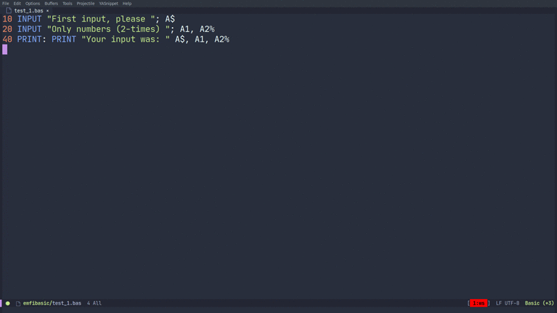
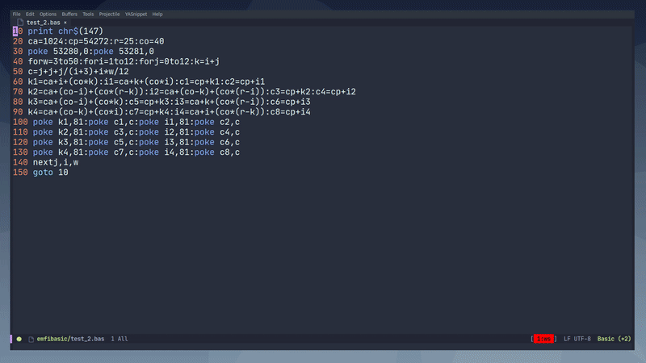

<p align="center">
  
</p>

## Contents
- [Requirements](#requirements)
- [Installation](#installation)
  - [From source](#source)
  - [Melpa](#melpa)
- [Features](#features)
  - [Flycheck checker](#flycheck)
  - [Company completion](#company)
  - [Cbmbasic support](#cbmbasic)
  - [VICE support](#vice)
- [License](#license)

## About
This is a minor mode for emacs, that provide some IDE features for the basic-mode , it has flycheck,company and helm support,
it also provide an easy way to integrate [Simon's BASIC](https://en.wikipedia.org/wiki/Simons%27_BASIC).
Provide 3 interpreters [cbmbasic](https://github.com/mist64/cbmbasic),[Bas 2.5](http://www.moria.de/~michael/bas/) and of course [VICE](https://vice-emu.sourceforge.io/).
For the moment, it's focus on the c64 support.


## Requirements

- emacs <=25
- helm 3.6.0
- basic-mode 0.4.2
- company-mode 1.21.4
- flycheck 31
- [cbmbasic](https://github.com/mist64/cbmbasic)
- [Bas 2.5](http://www.moria.de/~michael/bas/)
- [VICE](https://vice-emu.sourceforge.io/)
- [netcat](https://en.wikipedia.org/wiki/Netcat)

## Installation

### Source
Clone this repository and add the basic-ide.el file to the load path.

``` lisp
	(add-to-list 'load-path "path/to/basic-ide.el")
	(require 'basic-ide)
``` 
And to use it, launch

``` lisp
	(basic-ide-mode)
``` 


### Quelpa
	Install [quelpa](https://github.com/quelpa/quelpa) and eval this:

``` lisp
(quelpa '(basic-ide :fetcher git :url "https://gitlab.com/sasanidas/emacs-c64-basic-ide.git"))
``` 
	Add this to the init.el file:

``` lisp
(require 'basic-ide)
``` 


### Melpa
WIP


## Custom variables
There are some variable that can be customize to set the executable routes correctly.
You can customize it with the default customize feature that emacs has by default or
by the set command:

``` lisp
	(setq 
		basic-ide-cbmbasic-executable "/path/to/executable/cbmbasic"
		basic-ide-x64-executable "/usr/bin/x64"
		basic-ide-x64-kernal "/usr/lib/vice/C64/kernal"
		basic-ide-vice-simon-disk "/path/to/simonbasic/d64/disc"
		basic-ide-completion-backend '("completion" "words" ))
``` 

## Features
### Flycheck


It support the basic checker, created for this project, and it is enabled automatically 

``` lisp
  (flycheck-define-checker basic
    "A syntax checker for the Bas 2.5 interpreter http://www.moria.de/~michael/bas/"
    :command ("bas" (eval (buffer-file-name)) )
    :error-patterns
    ((error line-start  "Error: " (message) "in line " line " at:" line-end))
    :modes basic-mode)

  (add-to-list 'flycheck-checkers 'basic)
  (flycheck-mode)
``` 

### Company
It provide basic completion with company, with the basic keyword set, it is also enabled automatically

``` lisp
  (defun company-basic-ide-backend (command &optional arg &rest ignored)
    (interactive (list 'interactive))
    (cl-case command
      (interactive (company-begin-backend 'basic-ide-completion-backend))
      (prefix (and (eq major-mode 'basic-mode)
                   (company-grab-symbol)))
      (candidates
       (cl-remove-if-not
        (lambda (c) (string-prefix-p arg c))
        basic-ide-completion-backend))))
  (setq company-backends '(company-basic-ide-backend))
  (company-mode)
``` 

### Cbmbasic
It support cbmbasic for execute the entire file, or some areas.

#### Cbmbasic commands


Evaluate the entire file without interaction

``` lisp
	(basic-ide-local-execute)
``` 

---


Evaluate the selected region without interaction, and display the result in the output buffer

``` lisp
	(basic-ide-eval-region)
``` 

---



Creates an eshell buffer and execute the execute the entire file, it can be use if you have some interaction in your program. 

``` lisp
	(basic-ide-interactive-execute)
``` 

### VICE


It support decent VICE integration, can execute the file and the simon's basic library.

#### VICE commands
Start the VICE x64 emulator

``` lisp
	(basic-ide-vice-start-session)
``` 

---
Loads the buffer into VICE x64 emulator, it is still necessary to write RUN inside VICE

``` lisp
	(basic-ide-vice-executable)
``` 

---
Load the simon's BASIC cartridge,but it also can be use to load any .d64 file

``` lisp
	(basic-ide-vice-load-basic)
``` 

---
Restart the VICE emulator

``` lisp
	(basic-ide-vice-reset)
``` 


## License
basic-ide Copyright © 2020 by Fermin Munoz <fmfs@posteo.net>

basic-ide is free software: you can redistribute it and/or modify
it under the terms of the GNU General Public License as published by
the Free Software Foundation, either version 3 of the License, or
(at your option) any later version.

basic-ide is distributed in the hope that it will be useful,
but WITHOUT ANY WARRANTY; without even the implied warranty of
MERCHANTABILITY or FITNESS FOR A PARTICULAR PURPOSE.  See the
GNU General Public License for more details.

You should have received a copy of the GNU General Public License
along with basic-ide.  If not, see <http://www.gnu.org/licenses/>.
